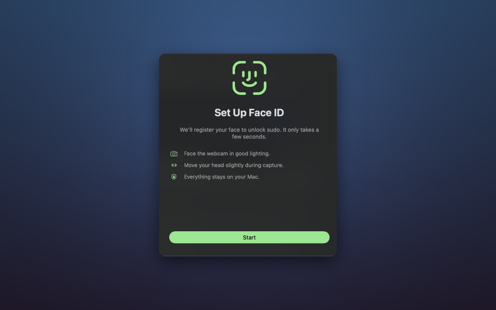
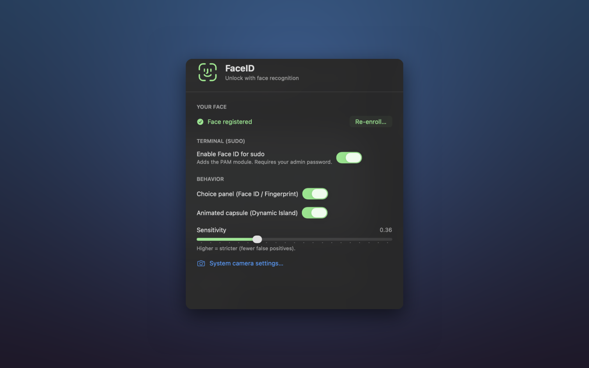
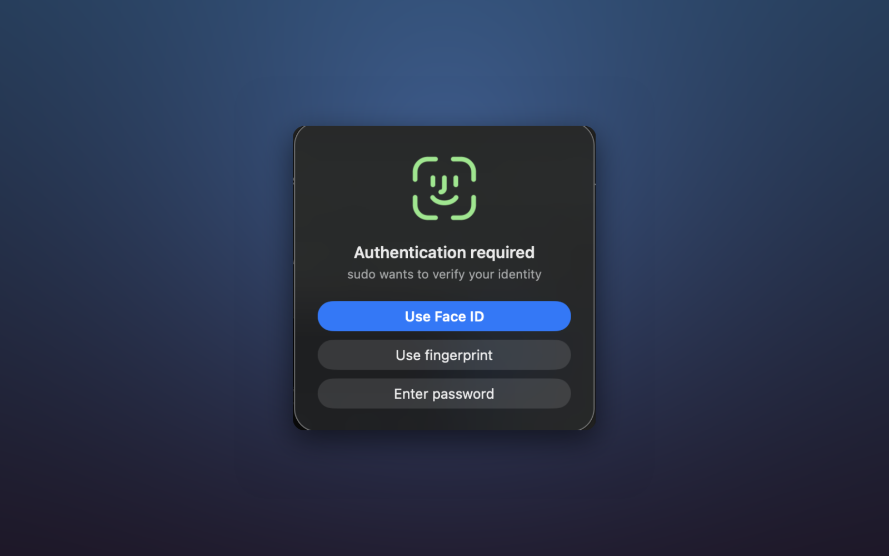
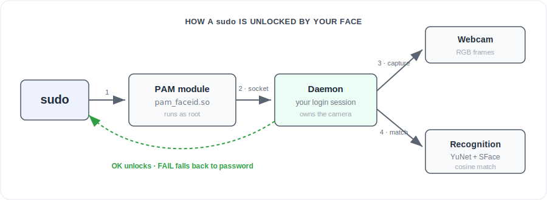

<div align="center">


# Mugshot

Unlock `sudo` with your face. A native macOS menu bar app that runs face
recognition fully on your Mac.

<p>
  <a href="https://github.com/Lorenzo-Coslado/macos-faceid/actions/workflows/ci.yml"></a>
  
  
  
</p>


</div>

## What it is

You type `sudo`, the camera recognizes you, and it unlocks. No password to type.

It started as a weekend hack and turned into a small but complete app: a guided
enrollment, a settings window, and a choice on every prompt between Face ID, Touch ID,
and your password. Everything is bundled into a single signed app, and nothing ever
leaves your Mac.

> [!IMPORTANT]
> This is a fun project, not a security product. A 2D webcam can be tricked by a photo,
> so it is not more secure than Touch ID. `sudo` always keeps your password as a
> fallback, so you can never lock yourself out.

## Installation

### 1. Download the app

<a href="https://github.com/Lorenzo-Coslado/macos-faceid/releases/latest/download/Mugshot.dmg">
  
</a>

Open the downloaded `Mugshot.dmg` and drag **Mugshot** into your **Applications** folder.
The app is signed and notarized by Apple, so it opens without any security warning.

### 2. Set up your face

Launch **Mugshot** from Applications. A small face icon appears in your menu bar. Click
it and choose **Set Up My Face**, then follow the enrollment (allow the camera when
macOS asks). It takes a few seconds.

<div align="center"></div>

### 3. Turn on Face ID for sudo

Open **Settings** from the menu and switch on **Enable Face ID for sudo**. Enter your
admin password once so the app can install its `sudo` component.

<div align="center"></div>

### 4. Use it

Run any `sudo` command in a terminal:

```bash
sudo -k && sudo true
```

The choice panel appears, the camera scans your face, and `sudo` unlocks. If the match
fails for any reason, you simply get the normal password prompt.

<div align="center"></div>

## How it works

<div align="center">
  
</div>

A root process started by `sudo` cannot reach the camera, because macOS blocks camera
access in that context (TCC). So a small **PAM module** hands the request to a **daemon**
that runs in your login session and owns the camera. The daemon finds your face with
[YuNet](https://github.com/opencv/opencv_zoo), turns it into an embedding with
[SFace](https://github.com/opencv/opencv_zoo), and compares it to the face you enrolled.
The PAM rule is `sufficient`, so a failed match falls through to your password.

## Security

A few things worth being clear about:

* **Spoofing.** An RGB webcam can be fooled by a printed photo or a video. Real Face ID
  uses an infrared depth sensor precisely to avoid this. Mugshot has no such protection.
* **Fallback.** Because the PAM rule is `sufficient`, a failed match, a stopped daemon,
  or even a deleted app all fall back to your password. You cannot get locked out.
* **Privacy.** Your face embeddings stay in `~/Library/Application Support/faceid` and
  never leave your machine. FileVault at boot still uses your password.

## Build from source

<details>
<summary>For developers</summary>

You need macOS on Apple Silicon, the Xcode Command Line Tools
(`xcode-select --install`) and Python 3.12 (`brew install python@3.12`).

```bash
git clone https://github.com/Lorenzo-Coslado/macos-faceid.git
cd macos-faceid
./install.sh
```

`install.sh` sets up a virtual environment, downloads the models, builds the native
helpers, and installs a development build of the app.

To produce the signed and notarized DMG you need a *Developer ID Application*
certificate and a `notarytool` keychain profile named `faceid-notary`:

```bash
./scripts/build-release.sh
```

</details>

## FAQ

<details>
<summary><b>Is it actually secure?</b></summary>

No, and it does not try to be. A 2D webcam can be tricked by a photo or a video. Keep it
for terminal convenience and keep Touch ID or your password as your real security.
</details>

<details>
<summary><b>What happens if it does not recognize me?</b></summary>

You get the normal password prompt, exactly like before. Nothing is lost. If it misses
you often, re-enroll in better lighting, or lower the sensitivity in Settings.
</details>

<details>
<summary><b>Does it send my face anywhere?</b></summary>

No. Detection, recognition and your enrolled face all stay on your Mac, in
`~/Library/Application Support/faceid`. There is no network code.
</details>

<details>
<summary><b>Which Macs are supported?</b></summary>

Apple Silicon Macs on macOS 13 or later, with any built-in or external webcam.
</details>

<details>
<summary><b>Can I still use Touch ID or my password?</b></summary>

Yes. Every prompt shows a panel with Face ID, Touch ID (Fingerprint), and Password. Pick
whichever you want. You can also hide the panel in Settings to go straight to Face ID.
</details>

<details>
<summary><b>Can it unlock the lock screen or the login window?</b></summary>

No. macOS protects the screen unlock path with SIP and does not let a third party plug
into it without losing Touch ID and the native UI, which Apple engineers confirmed on
the developer forums. For hands-free unlock, use an Apple Watch. The full write-up is in
[`LOCK-SCREEN-PLAN.md`](LOCK-SCREEN-PLAN.md).
</details>

<details>
<summary><b>How do I uninstall it?</b></summary>

Open Settings, turn off Face ID for sudo, quit the app, and move `Mugshot.app` to the
Trash. To delete your enrolled face, run `rm -rf ~/Library/Application\ Support/faceid`.
</details>

## Contributing

Issues and pull requests are welcome. See [CONTRIBUTING.md](CONTRIBUTING.md) and the
[Code of Conduct](CODE_OF_CONDUCT.md).

## Acknowledgments

Face detection and recognition use the [YuNet and SFace](https://github.com/opencv/opencv_zoo)
models from OpenCV Zoo. Built with OpenCV, Swift and SwiftUI.

## License

[MIT](LICENSE).
