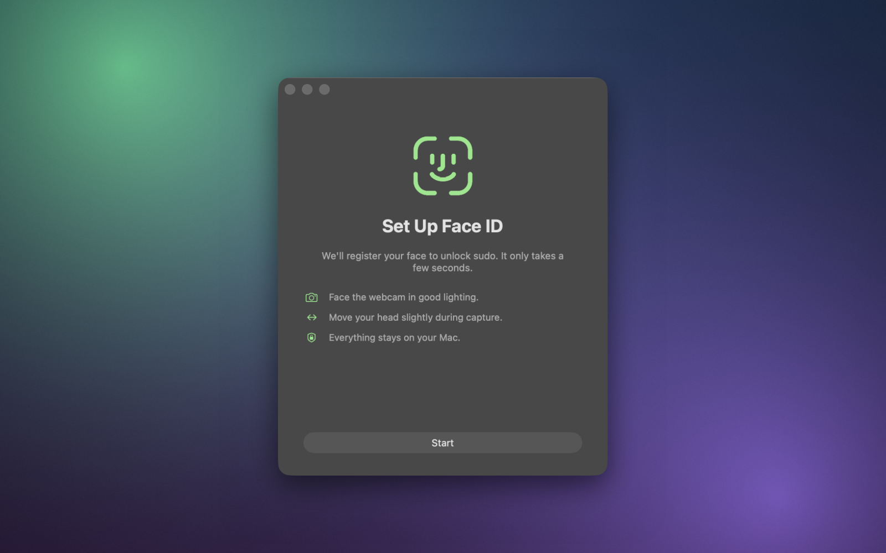
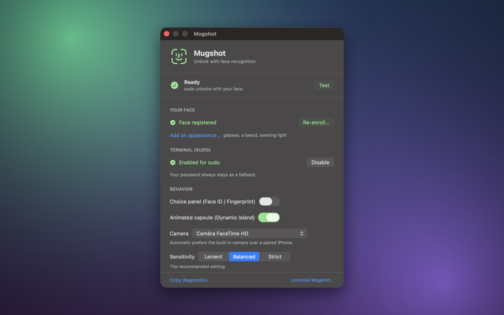
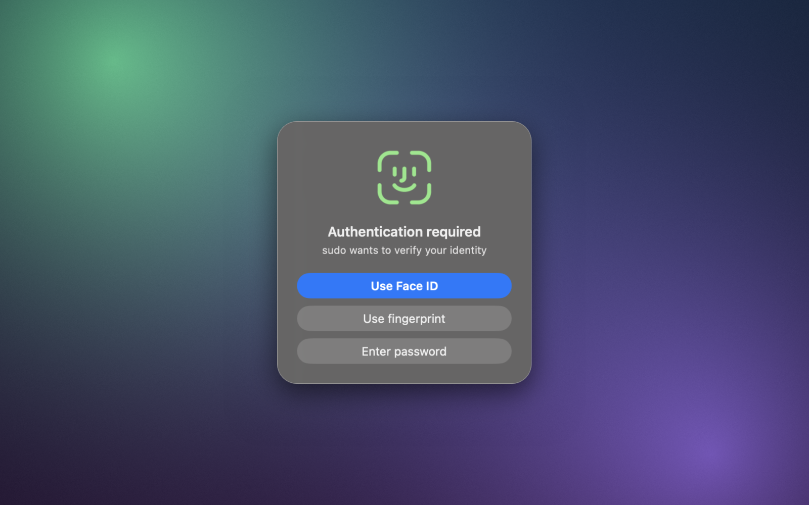
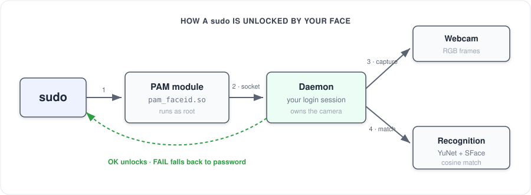

<div align="center">


# Mugshot

Unlock `sudo` with your face. A native macOS menu bar app that runs face
recognition fully on your Mac.

<p>
  <a href="https://github.com/Lorenzo-Coslado/macos-faceid/releases"></a>
  <a href="https://github.com/Lorenzo-Coslado/macos-faceid/actions/workflows/ci.yml"></a>
  
  
  
</p>


</div>

## What it is

You type `sudo`, the camera recognizes you, and it unlocks. No password to type.

It started as a weekend hack and turned into a small but complete app: a guided
enrollment, a single window that tells you whether the whole thing works, and a
`sudo` prompt that scans your face instead of waiting for your password.
Everything is bundled into one signed app, and nothing ever leaves your Mac.

> [!IMPORTANT]
> This is a fun project, not a security product. A 2D webcam can be tricked by a photo,
> so it is not more secure than Touch ID. `sudo` always keeps your password as a
> fallback, so you can never lock yourself out.

## Installation

### 1. Download the app

<a href="https://github.com/Lorenzo-Coslado/macos-faceid/releases/latest/download/Mugshot.dmg">
  
</a>

Open the downloaded `Mugshot.dmg` and drag **Mugshot** into your **Applications** folder.
The app is signed and notarized by Apple, so it opens without any security warning.

### 2. Register your face

Launch **Mugshot** from Applications. Its window opens, and a small face icon appears in
your menu bar. Register your face, allowing the camera when macOS asks. It takes a few
seconds.

<div align="center"></div>

### 3. Turn it on for sudo

The window tells you what is still missing and puts the button that fixes it right next
to the sentence. Click **Enable**.

macOS requires two one-time approvals before any app may touch the `sudo` configuration.
Both are listed up front, and each one ticks itself off the moment you grant it — you
never have to come back and start over:

1. **Allow Mugshot's helper**, in Settings › General › Login Items.
2. **Grant it Full Disk Access.** macOS keeps the `sudo` PAM file behind this permission,
   so the helper needs it to write that single file. It is used for nothing else.

Mugshot then writes the rule. Your password always stays as a fallback.

<div align="center"></div>

### 4. Use it

Run any `sudo` command in a terminal:

```bash
sudo -k && sudo true
```

A capsule appears at the top of the screen and the camera scans your face. If it
recognizes you, `sudo` unlocks. If it does not — or if you **click the capsule** to skip
the scan — you get the normal password prompt.

Prefer to be asked each time? Turn on **Choice panel** in the window to get a Face ID /
fingerprint / password panel before every scan.

<div align="center"></div>

## How it works

<div align="center">
  
</div>

A root process started by `sudo` cannot reach the camera, because macOS blocks camera
access in that context (TCC). So a small **PAM module** hands the request to a **daemon**
that runs in your login session and owns the camera. The daemon finds your face with
[YuNet](https://github.com/opencv/opencv_zoo), turns it into an embedding with
[SFace](https://github.com/opencv/opencv_zoo), and compares it to the face you enrolled.
The PAM rule is `sufficient`, so a failed match falls through to your password.

The daemon is a child process of Mugshot, and that is deliberate: launched by `launchd`
instead, macOS would attribute the camera request to the engine binary rather than to the
app, and deny it without even showing a prompt. The cost is that quitting Mugshot stops
face unlock — so it says so before it quits.

## Security

A few things worth being clear about:

* **Spoofing.** An RGB webcam can be fooled by a printed photo or a video. Real Face ID
  uses an infrared depth sensor precisely to avoid this. Mugshot has no such protection.
* **Fallback.** Because the PAM rule is `sufficient`, a failed match, a stopped daemon,
  or even a deleted app all fall back to your password. You cannot get locked out.
* **Privacy.** Your face embeddings stay in `~/Library/Application Support/faceid` and
  never leave your machine. FileVault at boot still uses your password.

## Build from source

<details>
<summary>For developers</summary>

You need macOS 14+ on Apple Silicon, the Xcode Command Line Tools
(`xcode-select --install`) and Python 3.12 (`brew install python@3.12`).

```bash
git clone https://github.com/Lorenzo-Coslado/macos-faceid.git
cd macos-faceid
./install.sh
```

`install.sh` sets up a virtual environment, downloads the models, builds the native
helpers, and installs a development build into `/Applications`.

**Tests.** `python -m faceid.selftest` checks the recognition pipeline;
`python tests/test_engine.py` covers the daemon's behaviour (warm-up, cancellation,
cumulative enrollment, socket protocol) without needing a camera;
`scripts/check-i18n.sh` verifies no translation key is missing or defined twice.
`scripts/diagnose.sh` reports which link of the chain is broken on a real install.

**Self-contained bundle**, no dependency on the checkout or its virtualenv:

```bash
./scripts/build-standalone.sh
```

**Signed release.** Needs a *Developer ID Application* certificate and a `notarytool`
keychain profile named `faceid-notary`:

```bash
./scripts/build-release.sh
```

**Installer package.** `scripts/build-pkg.sh` builds a `.pkg` instead of a disk image.
The system Installer already runs as root with the right to write `/etc/pam.d`, so a
single password replaces both permissions above, and it places the app in Applications
itself. Enabling `sudo` is an optional, pre-selected choice in the installer. Shipping it
requires a *Developer ID Installer* certificate — distinct from the Application one that
signs the app.

</details>

## FAQ

<details>
<summary><b>Is it actually secure?</b></summary>

No, and it does not try to be. A 2D webcam can be tricked by a photo or a video. Keep it
for terminal convenience and keep Touch ID or your password as your real security.
</details>

<details>
<summary><b>What happens if it does not recognize me?</b></summary>

You get the normal password prompt, exactly like before. Nothing is lost. If it misses
you often, add an appearance in the light you usually work in, or move sensitivity to
**Lenient**.
</details>

<details>
<summary><b>Can I add a second look — glasses, a beard?</b></summary>

Yes. In the window, under *Your face*, click **Add an appearance…**. It adds to your
enrolled face rather than replacing it, the way Face ID's alternate appearance does. Do
it in the light you usually work in.
</details>

<details>
<summary><b>Does it send my face anywhere?</b></summary>

No. Detection, recognition and your enrolled face all stay on your Mac, in
`~/Library/Application Support/faceid`. There is no network code.
</details>

<details>
<summary><b>Why does it ask for Full Disk Access?</b></summary>

Only to turn on `sudo`. Recent macOS versions keep the `sudo` PAM file behind Full Disk
Access, so Mugshot's small signed helper needs it to write that single file. It is not
used for anything else, nothing ever leaves your Mac, and if you never enable Face ID for
sudo it is never requested.
</details>

<details>
<summary><b>Which Macs are supported?</b></summary>

Apple Silicon Macs on macOS 14 or later, with any built-in or external webcam.
</details>

<details>
<summary><b>Can I still use Touch ID or my password?</b></summary>

Yes. Click the capsule during a scan to go straight to the password prompt. Turn on
**Choice panel** in the window to be offered Face ID, Touch ID and password before every
scan instead.
</details>

<details>
<summary><b>Can it unlock the lock screen or the login window?</b></summary>

No. macOS protects the screen unlock path with SIP and does not let a third party plug
into it without losing Touch ID and the native UI, which Apple engineers confirmed on
the developer forums. For hands-free unlock, use an Apple Watch. The full write-up is in
[`LOCK-SCREEN-PLAN.md`](LOCK-SCREEN-PLAN.md).
</details>

<details>
<summary><b>Why does sudo still ask for my password?</b></summary>

Because the PAM rule is `sufficient`, every failure degrades silently to the password
prompt — which makes the cause invisible. Open Mugshot: the top of the window names the
first thing that is missing. If it says *Ready* and `sudo` still asks, click **Copy
diagnostics** and read what it reports, or run `scripts/diagnose.sh` from a checkout.
</details>

<details>
<summary><b>How do I uninstall it?</b></summary>

Open Mugshot and click **Uninstall Mugshot…** at the bottom of the window. It removes the
`sudo` rule and the PAM module, restores the system Touch ID rule, unregisters the helper
and the login item, optionally deletes your enrolled face, and then offers to move the app
to the Trash.

Dragging the app to the Trash on its own is **not** enough: it leaves the PAM module and
the `sudo` rule behind, and system Touch ID for `sudo` stays switched off.
</details>

## Contributing

Issues and pull requests are welcome. See [CONTRIBUTING.md](CONTRIBUTING.md) and the
[Code of Conduct](CODE_OF_CONDUCT.md).

## Acknowledgments

Face detection and recognition use the [YuNet and SFace](https://github.com/opencv/opencv_zoo)
models from OpenCV Zoo. Built with OpenCV, Swift and SwiftUI.

## License

[MIT](LICENSE).
